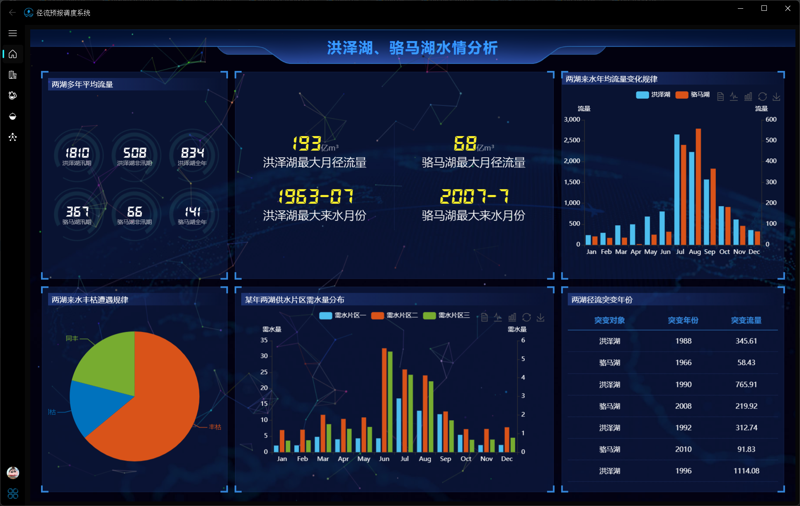
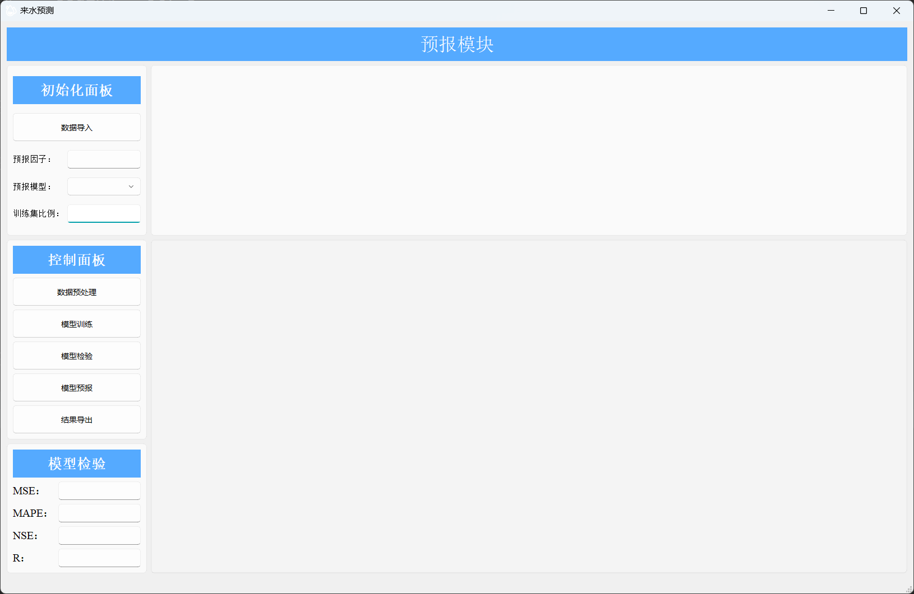

# Runoff_Forecast_Dispatch_System
## 系统简介
本系统是集成水情分析、来水预报、需水预报、水量调度于一体的水资源优化配置系统，系统基于python+mysql+echarts技术栈

## 系统架构

## 界面展示

### 登录界面
技术栈：mysql + pyqt
实现思路：通过在数据库中注入用户名和密码，进行匹配
加密方式：md5
密码找回：首次登录会在本地生成一个ini文件，记录用户名和密码，通过点击忘记密码会自行导入密码

### 主页
技术栈：html + js + echarts
### 水情分析

### 来水预测

### 水量调度

### 方案优化

## 计算原理

## 如何使用

