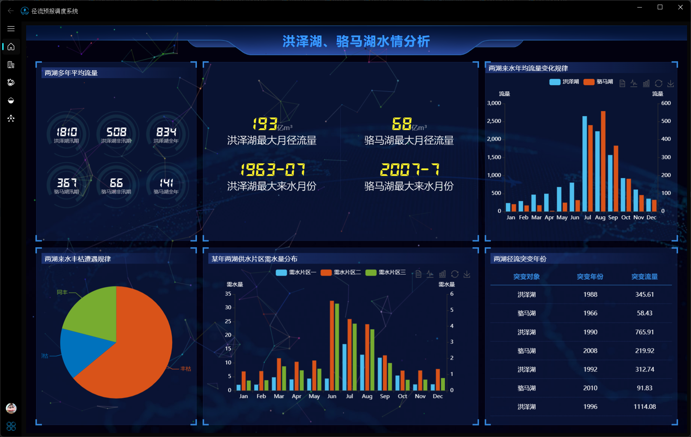
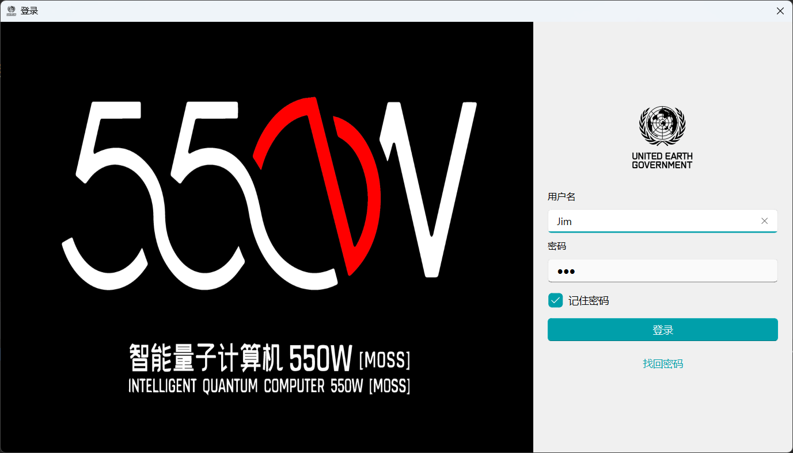
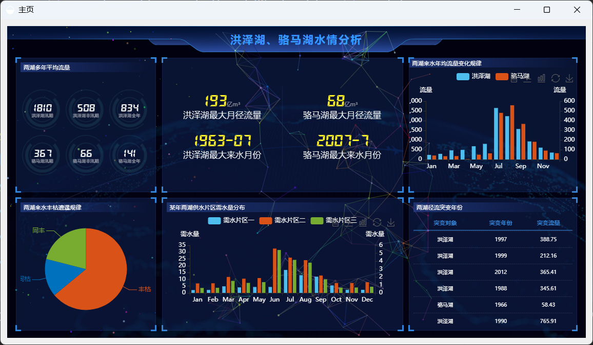
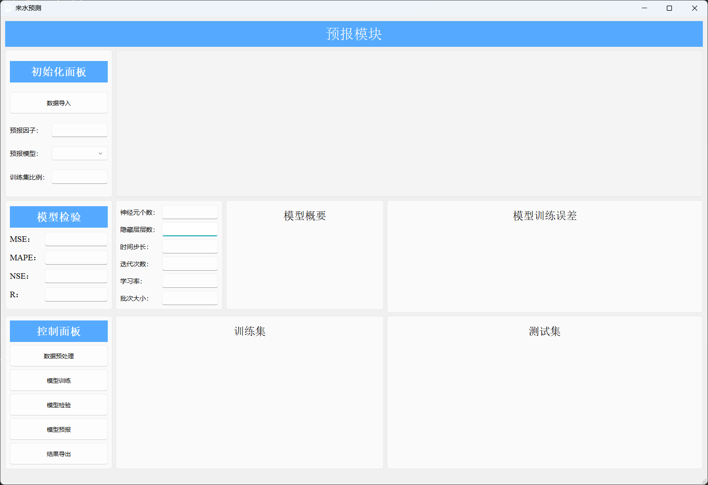

# Runoff_Forecast_Dispatch_System
## 系统简介
本系统是集成水情分析、来水预报、需水预报、水量调度于一体的水资源优化配置系统，系统基于python+mysql+echarts技术栈，**为避免版权纠纷，
开源算法均来源网络公开算法的改写，不涉及生产资料的使用！**

## 系统架构

## 界面展示


### 登录界面
技术栈：mysql + pyqt
实现思路：通过在数据库中注入用户名和密码，进行匹配
加密方式：md5
密码找回：首次登录会在本地生成一个ini文件，记录用户名和密码，通过点击忘记密码会自行导入密码

### 主页展示
技术栈：html + js + echarts

### 水情分析


### 来水预测

技术栈：pyqt + pytorch + matplotlib
算法思路：中长期径流预测形成规律具有极强的物理背景，本系统采用**递归单步预测**对齐进行算法构建，（由于特征构建部分涉及生产资料，
故本系统不对特征构建进行开源，有兴趣请翻阅论文自行编写）。
#### 预报算法
计划构建LSTM、BP、GRU等主要时间序列预测算法，看时间充裕程度逐步完善，目前主要完成LSTM预测算法的构建

#### 配置类
参数在界面进行自定义，初始化配置类，提高系统的鲁棒性
```python 
class Config():
    data_path = ''  # 文件路径
    timestep = 20  # 时间步长，就是利用多少时间窗口
    batch_size = 32  # 批次大小
    feature_size = 8  # 每个步长对应的特征数量，这里只使用1维
    hidden_size = 256  # 隐层大小
    output_size = 2  # 由于是多输出任务，最终输出层大小为2
    num_layers = 2  # lstm的层数
    epochs = 10 # 迭代轮数
    best_loss = 0 # 记录损失
    learning_rate = 0.0003 # 学习率
    model_name = 'lstm' # 模型名称
    save_path = './{}.pth'.format(model_name) # 最优模型保存路径
```
#### 时序数据集构建
```python
import numpy as np
def split_data(data, timestep, feature_size):
    dataX = []  # 保存X
    dataY = []  # 保存Y

    # 将整个窗口的数据保存到X中，将未来一天保存到Y中
    for index in range(len(data) - timestep):
        dataX.append(data[index: index + timestep])
        dataY.append(data[index + timestep][0])

    dataX = np.array(dataX)
    dataY = np.array(dataY)

    # 获取训练集大小
    train_size = int(np.round(0.8 * dataX.shape[0]))

    # 划分训练集、测试集
    x_train = dataX[: train_size, :].reshape(-1, timestep, feature_size)
    y_train = dataY[: train_size].reshape(-1, 1)

    x_test = dataX[train_size:, :].reshape(-1, timestep, feature_size)
    y_test = dataY[train_size:].reshape(-1, 1)

    return [x_train, y_train, x_test, y_test]
```
#### 数据归一化
数据的 归一化和标准化 是特征缩放(feature scaling)的方法，是数据预处理的关键步骤。
不同评价指标往往具有不同的量纲和量纲单位，这样的情况会影响到数据分析的结果，为了消除指标之间的量纲影响，
需要进行数据归一化/标准化处理，以解决数据指标之间的可比性。 原始数据经过数据归一化/标准化处理后，各指标处于同一数量级，适合进行综合对比评价。
```python
scaler = MinMaxScaler()
data = scaler_model.fit_transform(np.array(df))
```


### 水量调度

### 方案优化

## 计算原理

## 如何使用


